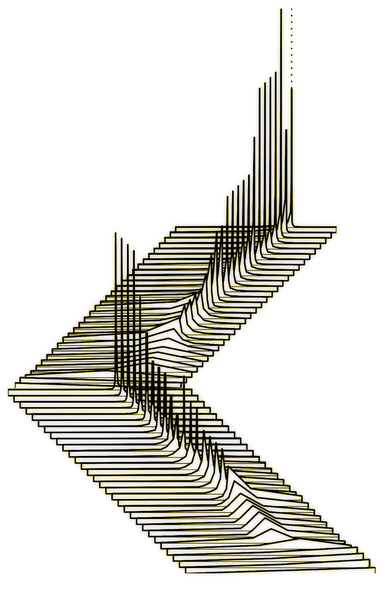

# Summer School 2018

## John H. Williamson / University of Glasgow

* [Introduction](i_introduction.ipynb)
* [Part 1: Learning control manifolds](ii_unsupervised.ipynb)
* [Part 2: Probabilistically filtering intent](iii_probabilistic.ipynb)

## Technical details
We will be using Jupyter notebooks with Python 2.7. These exercises will work best if you can run them on a local machine.

We recommend a standard [Anaconda 2.7 install](https://www.anaconda.com/download/). On top of Anaconda, we will need:

* keyboard `pip install keyboard`
* opencv `conda install -c conda-forge opencv`
* pykalman `pip install pykalman`
* weave `conda install -c conda-forge weave`

### I have an existing Python 3.x Anaconda
Create a Python 2.7 environment:

    conda create -n py27 python=2.7 anaconda

Then activate it with

    conda activate py27

Install the required packages above in this environment

    pip install keyboard
    conda install -c conda-forge opencv
    pip install pykalman
    conda install -c conda-forge weave

Now you will be able to run the materials

### Shouldn't we be using Python 3.x?
**Yes.** we didn't this year for consistency across modules. Most of these materials were *back-ported* from 3.x, so should be easy to convert if you want.
