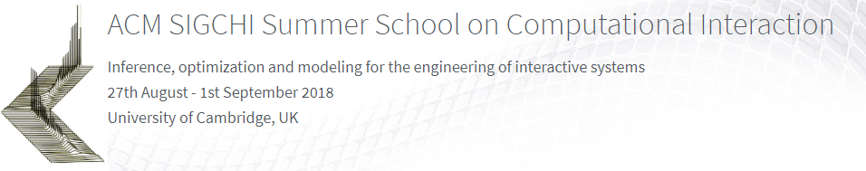

## John H. Williamson / University of Glasgow

* [Introduction](0_Introduction.ipynb)
* [Part 1: Learning control manifolds](1_Learning_Control_Manifolds.ipynb)
* [Part 2: Probabilistically filtering intent](2_Probabilistic_Filtering.ipynb)

## What is the purpose of this course?

This course aims to to take a fresh look at how computers determine what users want to do. We will examine machine learning approaches to inferring user intention from observed sensor signals.

After this course, you should be able to:

* Have a fundamental understanding of the input problem;
* Understand the ways in which human-input sensors can vary;
* Use unsupervised learning to learn **manifolds** or **clustering** which might explain apparently complex behaviour.
* How to attach manifolds of control ("compressed" versions of things that are sensed) to action spaces (things we might want to do)
* Use probabilistic inference to **reliably** infer and track an action states
* Use probabilistic models to accumulate information from the user reliably and efficiently.

## Technical details
We will be using Jupyter notebooks with Python 2.7. These exercises will work best if you can run them on a local machine.

We recommend a standard [Anaconda 2.7 install](https://www.anaconda.com/download/). On top of Anaconda, we will need:

* keyboard `pip install keyboard`
* opencv `conda install -c conda-forge opencv`
* pykalman `pip install pykalman`
* weave `conda install -c conda-forge weave`

### I have an existing Python 3.x Anaconda
Create a Python 2.7 environment:

    conda create -n py27 python=2.7 anaconda

Then activate it with

    conda activate py27

Install the required packages above in this environment

    pip install keyboard
    conda install -c conda-forge opencv
    pip install pykalman
    conda install -c conda-forge weave

Now you will be able to run the materials. Run `jupyter notebook` to bring up the notebook browser.

### Shouldn't we be using Python 3.x?
**Yes.** We didn't this year for consistency across modules. Most of these materials were *back-ported* from 3.x, so should be easy to convert if you want.
